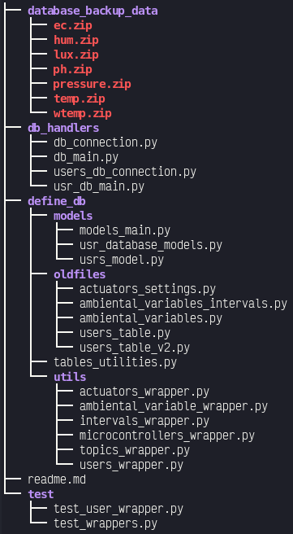

# maticas-database
--------------------------------------------------------------------

Here we develop the database branch of maticas project, on this release
we create a model which handles multiple users and each user has his own 
database and information.

The structure of this repo is the following:

.

Inside "db" folder lays the core of the code, and an overall explaination of what is inside each folder 
is the following:

* docs -> General documentation of the code.
* db/database_backup_data -> Some example data which was stored from previous development of maticas.
* db/db_handlers  -> Contains the definition of the classes which handle the database connection.
* db/define_db -> Models and Utilities for the tables.
* db/define_db/models -> Database schema definition.
* db/define_db/utils -> Defines wrappers which add functionality to the created tables.
* db/define_db/tables_utilities.py -> Defines utilities for checking the databases existence and loading tables.

